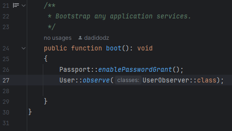
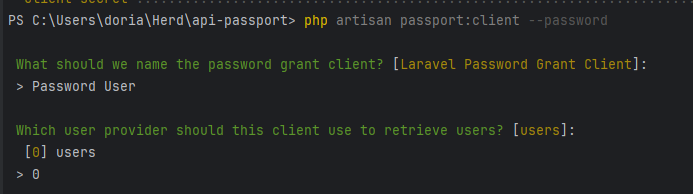
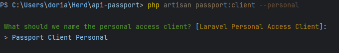

<p style="text-align: center;">
  <a href="https://laravel.com" target="_blank">
    
  </a>
</p>

# Pré-requis

#### 1. Désactiver l'envoi d'email à la création d'un nouvel utilisateur :

Commenter la ligne 27 dans AppServiceProvider.php : User::observe(UserObserver::class);
<p style="text-align: center;">
  <a href="https://laravel.com" target="_blank">
    
  </a>
</p>

#### 2. Lancer les migrations et les seeders avec les commandes :

php artisan migrate

php artisan db:seed

#### 3. Ajouter la configuration de passport avec la commande :

php artisan passport:client --password

Saisir :
<p style="text-align: center;">
  <a href="https://laravel.com" target="_blank">
    
  </a>
</p>

**Récupérer** : Client ID, client_secret

#### 4. Sur postman : lancer la requête "post oauth token" avec ces paramètres :

- **grant-type** : password
- **client_id** : 1
- **client_secret** : client secret récupérer précédemment
- **username** : admin@admin.com
- **password** : password

**Récupérer** : access_token

#### 5. Ajouter la configuration de passport avec la commande :

php artisan passport:client --personal

Saisir :
<p style="text-align: center;">
  <a href="https://laravel.com" target="_blank">
    
  </a>
</p>


#### 6. Remplacer le bearer token des requêtes postman par l'access_token récupéré

# Routes API et utilisations

### **La collection des routes API au format JSON est disponibles ici : sugoiquiz-chan/resources/postman**

⭐ : Les routes suivie de cette étoile sont des routes uniquement accessible par un admin. Dans Postman, il est nécessaire de renseigner l'access_token dans Authorization > Bearer token.

## Utilisateurs

#### Créer un utilisateur

```http
  POST /api/users/create
```
Accessible par tout le monde, même sans token.

| Parameter  | Type     | Description                                    |
|:-----------| :------- |:-----------------------------------------------|
| `name`     | `string` | **Requis**. Le nom de l'utilisateur            |
| `email`    | `string` | **Requis et unique**. L'email de l'utilisateur |
| `password` | `string` | **Requis**. Le mot de passe de l'utilisateur   |

#### Récupérer les utilisateurs ⭐

```http
  GET /api/users
```

#### Récupérer un utilisateur spécifique par son ID ⭐

```http
  GET /api/users/${id}
```

#### Modifier un utilisateur par son ID ⭐

```http
  PATCH /api/users/${id}
```

| Parameter  | Type      | Description                                            |
|:-----------|:----------|:-------------------------------------------------------|
| `name`     | `string`  | **Optionel**. Le nouveau nom de l'utilisateur          |
| `email`    | `string`  | **Optionel**. Le nouveau email de l'utilisateur        |
| `password` | `string`  | **Optionel**. Le nouveau mot de passe de l'utilisateur |
| `is_admin` | `boolean` | **Optionel**. Le grade is_admin                        |

#### Supprimer un utilisateur spécifique par son ID ⭐

```http
  DELETE /api/users/${id}
```

## Animes

#### Créer un anime ⭐

```http
  POST /api/animes
```


| Parameter      | Type     | Description                                           |
|:---------------| :------- |:------------------------------------------------------|
| `title`        | `string` | **Requis**. Le titre de l'anime                       |
| `description`  | `string` | **Requis**. La description de l'anime                 |
| `imageURL`     | `string` | **Requis**. URL de l'image de l'anime                 |
| `release_date` | `string` | **Requis**. La date de sortie de l'anime              |
| `details`      | `string` | **Optionel**. Des détails supplémentaires sur l'anime |

#### Récupérer les animes ⭐

```http
  GET /api/animes
```


#### Récupérer un anime spécifique par son ID ⭐

```http
  GET /api/animes/${id}
```


#### Modifier un anime par son ID ⭐

```http
  PATCH /api/animes/${id}
```

| Parameter      | Type     | Description                                           |
|:---------------| :------- |:------------------------------------------------------|
| `title`        | `string` | **Optionel**. Le titre de l'anime                     |
| `description`  | `string` | **Optionel**. La description de l'anime               |
| `imageURL`     | `string` | **Optionel**. URL de l'image de l'anime               |
| `release_date` | `string` | **Optionel**. La date de sortie de l'anime            |
| `details`      | `string` | **Optionel**. Des détails supplémentaires sur l'anime |

#### Supprimer un anime spécifique par son ID ⭐

```http
  DELETE /api/animes/${id}
```

## Musics

#### Récupérer les musiques ⭐

```http
  GET /api/musics
```


#### Récupérer une musique spécifique par son ID ⭐

```http
  GET /api/musics/${id}
```

#### Modifier une musique par son ID ⭐

```http
  PATCH /api/musics/${id}
```

| Parameter   | Type     | Description                                            |
|:------------| :------- |:-------------------------------------------------------|
| `title`     | `string` | **Optionel**. Le titre de la musique                   |
| `file`      | `string` | **Optionel**. Le lien du fichier MP3 de la musique     |
| `duration`  | `string` | **Optionel**. La durée en seconde de la musique        |
| `animes_id` | `string` | **Optionel**. L'ID de l'anime d'où provient la musique |

#### Supprimer une musique spécifique par son ID ⭐

```http
  DELETE /api/musics/${id}
```

## Connexion

#### Récupération du token d'un utilisateur

```http
  POST /oauth/token
```

| Parameter       | Type     | Description                                  |
|:----------------|:---------|:---------------------------------------------|
| `grant-type`    | `string` | **Requis**. Password                         |
| `client_id`     | `number` | **Requis**. 1                                |
| `client secret` | `string` | **Requis**. client_secret                    |
| `username`      | `string` | **Requis**. L'adresse email de l'utilisateur |
| `password`      | `string` | **Requis**. Le mot de passe de l'utilisateur |

#### Connexion (pour utilisation front)

```http
  POST /api/login
```

| Parameter       | Type     | Description                                  |
|:----------------|:---------|:---------------------------------------------|
| `username`      | `string` | **Requis**. L'adresse email de l'utilisateur |
| `password`      | `string` | **Requis**. Le mot de passe de l'utilisateur |


